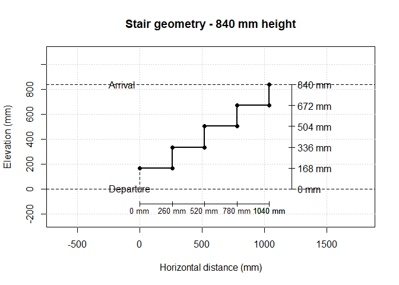
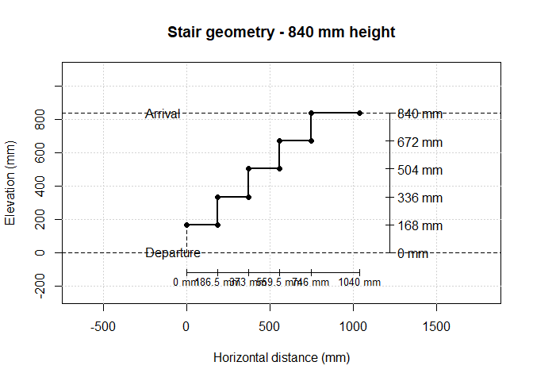
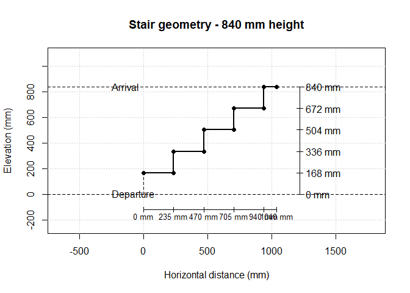

<!-- README.md is generated from README.Rmd. Please edit that file -->

# stairtools

<!-- badges: start -->

<!-- badges: end -->

stairtools provides tools to compute and visualize straight stair
geometries from basic architectural constraints.

The package separates the calculation into three main steps:

1.  stair rise: determines the number of rises and the riser height from
    the total height.
2.  stair run: computes the horizontal development of the flight.
3.  stair geometry: builds the complete stepped profile.

## Design principle

The main function is `stair_compute()`, which combines these steps into
a complete stair solution.

`max_run` represents the maximum available horizontal space, not a
length that must be fully occupied. If this maximum theoretical value
indicated does not fit in the available space, it is reduced
accordingly. This means that a large available length does not
automatically produce a longer stair: the unused space remains
available.

The stair geometry follows the Blondel - comfort - relationship:

$$2r + g = B$$

where $r$ is the riser height, $g$ is the tread depth (going), and $B$
is the target Blondel value.

## Installation

Install the development version from GitHub:

``` r
# install.packages("remotes")

remotes::install_github("clement-LVD/stairtools")
```

``` r

library(stairtools)

s <- stair_compute(height = 840, max_run = 1040)

plot(s$geometry)
```

<!-- -->

The returned object contains:

- s\$rise : vertical stair calculation
- s\$build : horizontal stair calculation
- s\$geometry : complete stair profile
- s\$unused_run : remaining available horizontal space

The plot displays:

- the stepped profile,
- departure and arrival reference levels,
- cumulative horizontal dimensions,
- cumulative vertical dimensions.

Main parameters:

- blondel_target controls the preferred comfort relationship,
- min_going prevents unrealistic very small treads,
- max_going limits excessively deep treads.

## Units

All dimensions are expressed in millimetres.

## Optional parameters

Add a landing step with depth similar to the other steps:

``` r
 

s <- stair_compute(height = 840, max_run = 1040, last_step_is_landing = TRUE)

plot(s$geometry)
```

<!-- -->

Add a landing step with a custom depth :

``` r
 
s <- stair_compute(height = 840, max_run = 1040, end_depth = 100, last_step_is_landing = TRUE )

plot(s$geometry)
```

<!-- -->
