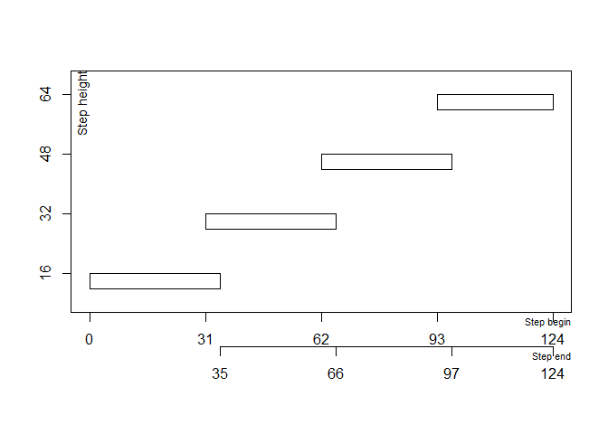
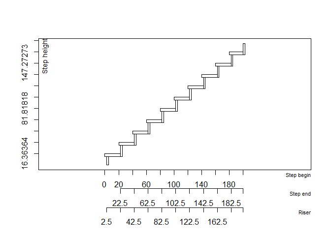
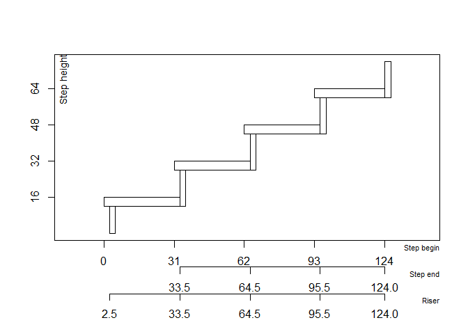
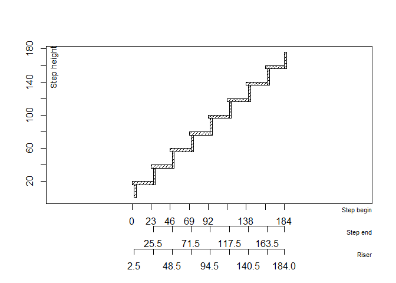
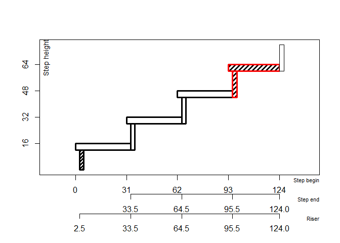
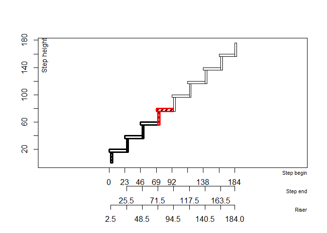

<!-- README.md is generated from README.Rmd. Please edit that file -->

# stairtools

<!-- badges: start -->

[](https://github.com/Clement-LVD/stairtools/actions/workflows/R-CMD-check.yaml)
[](https://app.codecov.io/gh/Clement-LVD/stairtools)
<!-- badges: end -->

🪜 `stairtools` is an R package designed to calculate and visualise
*staircase* designs, based on basic architectural constraints. Results
are sorted according to a step height optimization, in order to choose
easily the best stair dimensioning.

## Installation

<!-- 
Install the released version from CRAN:
&#10;``` r
install.packages("stairtools")
```
-->

Install the latest development version from GitHub:

``` r
# install.packages("remotes")
remotes::install_github("clement-LVD/stairtools")
```

## Preamble and usage

**㎝.** All dimensions are expressed in *centimetres*.

**Input.** The user must indicate a total rise to elevate and a total
length available. If length is not a constraint on your project, you can
specify a very large value.

**Output.** The package calculates all possible – reasonable – staircase
configurations and return various solutions, i.e. varying numbers of
steps and whether or not there is a landing step.

> 𓊍 The possible solutions are scored according to Blondel’s rule (see
> below).

**Blondel’s value.** A stair geometry follows the Blondel - comfort -
relationship.

$$2r + g = B$$

Where $r$ is the rise (vertical riser height), $g$ is the going
(horizontal tread depth), and $B$ is the target Blondel value.

𓊍 In French carpentry and masonry practices for domestic staircase
construction, the Blondel ideal value should be 63 cm. It is recommended
to prioritise the staircase solution with the smallest deviation from
this Blondel target value. From this French point of view, solutions
with a Blondel value between 60 cm and 64 cm are acceptable.

**Best solution.** Possible solutions are sorted by their deviation from
the Blondel target value, default is 63 cm.

**Edges cases.** When several solutions have a similar Blondel value,
solutions are sorted by their deviation from the minimum rise, i.e. 16
cm. This is to ensure that the staircase is comfortable for older
people, those wearing high-heeled shoes, children, small dogs and old
dogs, etc.

## Examples

The examples cover the various stair calculations provided by
`solve_stairs()`, followed by the graphical parameters provided by
`plot_stair()`.

### Stair computations

**Basic concrete stairs.** `solve_stairs()` compute various basic stair
solutions, given a total height and a maximum horizontal run available.
The function returns a `data.frame` listing several solutions, the most
relevant of which is the first entry. A `list` variable called
`geometry` provides the coordinates for each solution, with one entry
for each solution in the main data.frame, in the same order.

``` r

library(stairtools)

sol <- solve_stairs(total_height = 103, max_horizontal_run =  133)

print(sol)
#> 
#>   1 valid solution(s)
#>   n_risers step_rise rise_target_deviation    going           scenario
#> 2        6  17.16667              1.166667 28.66667 no_landing_uniform
#>   horizontal_run  blondel blondel_target_deviation has_landing
#> 2            133 60.93333                 2.066667       FALSE
#>   horizontal_run_exceeded landing_impossible is_valid rank
#> 2                   FALSE              FALSE     TRUE    1
#> ('geometry' list-col is hidden - access via $geometry[[i]])

# plot the best solution
plot_stair(sol$geometry[[1]]) 
```

<!-- -->

Some staircase designs have a landing step at the top. For these
solutions, thhe `has_landing` variable is set to `TRUE`.

``` r

sol2 <- solve_stairs(total_height = 68, max_horizontal_run =  133)

landing_step_solutions <- sol2[sol2$has_landing == TRUE, ]
 
# plot the best solution within solutions providing a landing step
plot_stair(landing_step_solutions$geometry[[1]]) 
```

<!-- -->

By default, `solve_stairs()` return basic concrete stairs, computed with
`tread_thickness = 0, riser_thickness = 0, nosing = 0` and riser -
vertical limit - are ploted with `riser = TRUE`, the default - as shown
above.

**Tread thickness and nosing.** The example below shows a 7 cm thick
covering layer over a concrete staircase, extending outwards to leave a
4 cm stair nosing. The parameters are therefore
`tread_thickness = 7, nosing = 4, riser_thickness = 0`.

``` r

sol3 <- solve_stairs(80, 150, tread_thickness = 7, nosing = 4, riser_thickness = 0)

plot_stair(sol3$geometry[[1]], riser = TRUE)
```

<!-- -->

When a stair nosing is required, the final top step is shorter by
default - in order to maintain a constant going and thus avoid a
‘top-of-the-flight’ effect.

**Alternative nosing direction.** Nosing can instead be added in the
negative direction with `positive_nosing_direction = FALSE`.

``` r

sol_neg <- solve_stairs(80, 150, tread_thickness = 4, nosing = 2.5, positive_nosing_direction = FALSE)
 
plot_stair(sol_neg$geometry[[1]])
```

<!-- -->

With this setting, all steps keep the same theoretical going, but the
first step may protrude beyond the indicated available space. With the
default positive direction, the last step is shortened instead, so that
the staircase does not extend beyond the available run.

**Wood-stairs.** Wood stairs can be computed by specifying
`tread_thickness` `riser_thickness` and or `nosing` parameters,
expressed in centimeters.

``` r

wood_stairs <- solve_stairs(80, 150, tread_thickness = 4, riser_thickness = 2.6, nosing = 2.5)

plot_stair(wood_stairs$geometry[[1]])
```

<!-- -->

By default, the risers are positioned behind the tread, they do not
overlap the nosing.

**Risers.**

xxx todo : various risers computations xxx

**Open-riser stairs.** Open-riser stairs can be plotted with
`plot_stair(riser = FALSE)`. By default, `plot_stair()` displays the
vertical risers.

``` r
sol4 <- solve_stairs(80, 150, tread_thickness = 4,  nosing = 4)

plot_stair(sol4$geometry[[1]], riser = FALSE)
```

<!-- -->

# Legal and regulatory aspects

To qualify the solutions, the `check_stair_rules` parameters adds
various logical columns relating to the legal or academic compliance of
the proposed staircases.

``` r

wood_stairs <- solve_stairs(180, 200, tread_thickness = 4, riser_thickness = 2.6, nosing = 2.5, check_stair_rules = TRUE)

# several logical columns and numeric (n_rules_ok & rate_rules_ok) are added
print(wood_stairs) 
#> 
#>   5 valid solution(s)
#>    n_risers step_rise rise_target_deviation    going           scenario
#> 9         9  20.00000             4.0000000 23.00000 no_landing_blondel
#> 12        9  20.00000             4.0000000 23.00000        landing_max
#> 10        9  20.00000             4.0000000 23.00000 no_landing_uniform
#> 6        10  18.00000             2.0000000 27.00000 no_landing_uniform
#> 2        11  16.36364             0.3636364 30.27273 no_landing_uniform
#>    horizontal_run  blondel blondel_target_deviation has_landing
#> 9             184 63.00000                 0.000000       FALSE
#> 12            200 63.00000                 0.000000        TRUE
#> 10            200 65.00000                 2.000000       FALSE
#> 6             200 58.22222                 4.777778       FALSE
#> 2             200 52.72727                10.272727       FALSE
#>    horizontal_run_exceeded landing_impossible is_valid rank
#> 9                    FALSE              FALSE     TRUE    1
#> 12                   FALSE              FALSE     TRUE    2
#> 10                   FALSE              FALSE     TRUE    3
#> 6                    FALSE              FALSE     TRUE    4
#> 2                    FALSE              FALSE     TRUE    5
#>    US_ADA_public_stairs US_ADA_pool_stairs US_ADA_pool_transfer_steps
#> 9                 FALSE              FALSE                      FALSE
#> 12                FALSE              FALSE                      FALSE
#> 10                FALSE              FALSE                      FALSE
#> 6                 FALSE              FALSE                      FALSE
#> 2                  TRUE               TRUE                      FALSE
#>    US_IBC_means_of_egress US_IBC_dwelling_units
#> 9                    TRUE                 FALSE
#> 12                   TRUE                 FALSE
#> 10                   TRUE                 FALSE
#> 6                    TRUE                  TRUE
#> 2                    TRUE                  TRUE
#>    US_IBC_guard_towers_observation_stations_and_control_rooms
#> 9                                                       FALSE
#> 12                                                      FALSE
#> 10                                                      FALSE
#> 6                                                       FALSE
#> 2                                                        TRUE
#>    US_IRC_means_of_egress US_IRC_sleeping_loft
#> 9                   FALSE                 TRUE
#> 12                  FALSE                 TRUE
#> 10                  FALSE                 TRUE
#> 6                    TRUE                 TRUE
#> 2                    TRUE                FALSE
#>    FR_collective_housing_common_areas FR_private_dwelling_interior
#> 9                               FALSE                        FALSE
#> 12                              FALSE                        FALSE
#> 10                              FALSE                        FALSE
#> 6                               FALSE                         TRUE
#> 2                                TRUE                         TRUE
#>    FR_ERP_accessibility FR_workplace_accessibility FR_public_circulation_stairs
#> 9                 FALSE                      FALSE                        FALSE
#> 12                FALSE                      FALSE                        FALSE
#> 10                FALSE                      FALSE                        FALSE
#> 6                 FALSE                      FALSE                        FALSE
#> 2                 FALSE                      FALSE                        FALSE
#>    ISO_machinery_access UK_private UK_utility UK_general_access
#> 9                  TRUE       TRUE      FALSE             FALSE
#> 12                 TRUE       TRUE      FALSE             FALSE
#> 10                 TRUE       TRUE      FALSE             FALSE
#> 6                 FALSE       TRUE       TRUE             FALSE
#> 2                 FALSE      FALSE      FALSE             FALSE
#>    academic_compromise etiological_studies feet_accommodation n_rules_ok
#> 9                FALSE               FALSE              FALSE          4
#> 12               FALSE               FALSE              FALSE          4
#> 10               FALSE               FALSE              FALSE          4
#> 6                 TRUE                TRUE              FALSE          9
#> 2                 TRUE                TRUE               TRUE         11
#>    rate_rules_ok
#> 9           0.20
#> 12          0.20
#> 10          0.20
#> 6           0.45
#> 2           0.55
#> ('geometry' list-col is hidden - access via $geometry[[i]])

plot_stair(wood_stairs$geometry[order(-wood_stairs$rate_rules_ok)][[1]] )
```

<!-- -->

> The Blondel value used as a reference by `solve_stairs` (63 cm)
> reflect the traditional French stair geometry criteria and does not
> allow compliance with most of the proposed standards when risers
> heights \> 17 cm are adopted.

> Not all standards are necessarily relevant to your situation since
> some standards apply specifically to a country or a particular type of
> staircase, e.g., according to the ISO standard, a stair that is a
> permanent mean of access to machinery require a Blondel value between
> 60 cm and 66 cm[^1].

### Graphical parameters

`plot_stair()` uses base R’s `graphics::polygon()` to draw each stair
surface. Graphical parameters can therefore be passed through
`polygon_params`.

For example, the colour and border of all stair surfaces can be changed.

``` r

plot_stair(
 wood_stairs$geometry[[1]],
  polygon_params = list(
    col = "grey90",
    border = "black",
    lwd = 2
  )
)
```

<!-- -->

Other graphical parameters supported by `graphics::polygon()` can also
be used, including line types and hatching.

``` r
plot_stair(
  wood_stairs$geometry[[1]],
  polygon_params = list(
    col = "black",
    border = "black",
    density = 25,
    angle = 45
  )
)
```

<!-- -->

Styles can be applied selectively to specific steps or surfaces. The
`surface` selector accepts “tread” or “riser”, while steps can be a
single step number or a vector of step numbers.

For example, treads and risers can be displayed differently.

``` r
plot_stair(
  wood_stairs$geometry[[1]],
  styles = list(
    list(
      surface = "tread",
      col = "black",
      density = 25,
      angle = 45
    ),
    list(
      surface = "riser",
      col = "grey50"
    )
  )
)
```

<!-- -->

Styles can also target individual step with `steps = c()`.

``` r
plot_stair(
  wood_stairs$geometry[[1]],
  styles = list( 
    list(
      steps = 1:4,
      col = "white",
      border = "black",
      lwd = 3
    ), list(
      steps = 1,
      surface = "riser", col = "black", density = 20,
    angle = 45 
    ),
    list(
      steps = 4,
      col = "black",
      border = "red",
      density = 15,
    angle = 45 
    )
  )
)
```

<!-- -->

Styles are applied in order. When several styles apply to the same
polygon, parameters defined by a later style replace parameters with the
same name defined by earlier styles.

The polygon_params argument therefore provides a global default style if
no `steps` is specified, while styles can be used to override individual
steps or surfaces.

All graphical parameters accepted by graphics::polygon() can be passed
in this way.

[^1]: International Organization for Standardization. (2016). Safety of
    machinery — Permanent means of access to machinery — Part 3: Stairs,
    stepladders and guard-rail (ISO Standard No. 14122-3:2016).
    <https://www.iso.org/standard/61282.html>
