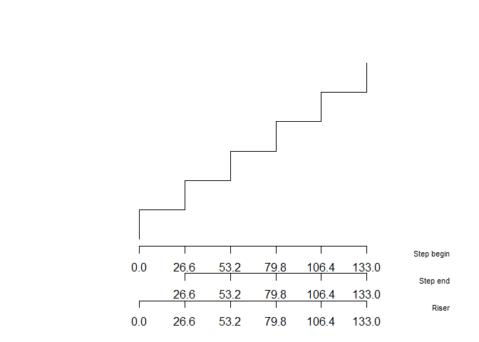
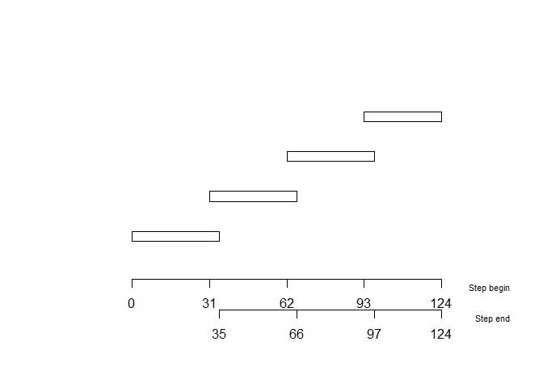

# stairtools

🪜 `stairtools` is an R package designed to calculate and visualise
*staircase* designs, based on basic architectural constraints. Results
are sorted according to a step height optimization, in order to choose
easily the best stair dimensioning.

## Installation

Install the latest development version from GitHub:

``` r

# install.packages("remotes")
remotes::install_github("clement-LVD/stairtools")
```

## Preamble and usage

**㎝.** All dimensions are expressed in *centimetres*.

**Input.** The user must indicate a total rise to elevate and a total
length available. If length is not a constraint on your project, you can
specify a very large value.

**Output.** The package calculates all possible – reasonable – staircase
configurations and return various solutions, i.e. varying numbers of
steps and whether or not there is a landing step.

> 𓊍 The possible solutions are scored according to Blondel’s rule (see
> below).

**Blondel’s value.** A stair geometry follows the Blondel - comfort -
relationship.

``` math
2r + g = B
```

Where $`r`$ is the rise (vertical riser height), $`g`$ is the going
(horizontal tread depth), and $`B`$ is the target Blondel value.

𓊍 In French carpentry and masonry practices for domestic staircase
construction, the Blondel ideal value should be 63 cm. It is recommended
to prioritise the staircase solution with the smallest deviation from
this Blondel target value. From this French point of view, solutions
with a Blondel value between 60 cm and 64 cm are acceptable.

**Best solution.** Possible solutions are sorted by their deviation from
the Blondel target value, default is 63 cm.

**Edges cases.** When several solutions have a similar Blondel value,
solutions are sorted by their deviation from the minimum rise, i.e. 16
cm. This is to ensure that the staircase is comfortable for older
people, children and dogs.

## Examples

### Basic concrete stairs

Compute stairs with
[`solve_stairs()`](https://clement-lvd.github.io/stairtools/reference/solve_stairs.md),
given a total_height and a maximum horizontal run available.

``` r


library(stairtools)

sol <- solve_stairs(total_height = 103, max_horizontal_run =  133)

print(sol)
#> 
#>   2 valid solution(s)
#>   n_risers step_rise rise_target_deviation    going           scenario
#> 2        6  17.16667              1.166667 28.66667 no_landing_uniform
#> 5        6  17.16667              1.166667 28.66667    landing_uniform
#>   horizontal_run  blondel blondel_target_deviation has_landing
#> 2            133 60.93333                 2.066667       FALSE
#> 5            133 56.50000                 6.500000        TRUE
#>   horizontal_run_exceeded landing_impossible is_valid rank
#> 2                   FALSE              FALSE     TRUE    1
#> 5                   FALSE              FALSE     TRUE    2
#> ('geometry' list-col is hidden - access via $geometry[[i]])

# plot the best solution
plot_stair(sol$geometry[[1]]) 
```



Basic concrete stairs are computed with
`tread_thickness = 0, riser_thickness = 0, nosing = 0`, the default.
Riser - vertical limit - are ploted with `riser = TRUE`, the default.

``` r


sol3 <- solve_stairs(80, 150, tread_thickness = 0, riser_thickness = 0, nosing = 0)

plot_stair(sol3$geometry[[1]], riser = TRUE)
```


### Wood-stairs and advanced parameters

Compute wood stairs by indicating `tread_thickness` `riser_thickness`
and or `nosing` parameters, expressed in centimeters.

``` r


sol2 <- solve_stairs(80, 150, tread_thickness = 4, riser_thickness = 2, nosing = 2.5)

# some computed solutions have a landing step
landing_step_solutions <- sol2[sol2$has_landing == TRUE, ]

plot_stair(landing_step_solutions$geometry[[1]])
```


Add nosing in negative direction with
`positive_nosing_direction = FALSE` parameter.

``` r


sol_neg <- solve_stairs(80, 150, tread_thickness = 4, riser_thickness = 2, nosing = 2.5, positive_nosing_direction = FALSE)
 
plot_stair(sol_neg$geometry[[1]])
```


> Note that the front edge of the top step of the staircase may protrude
> beyond the indicated available space if
> `positive_nosing_direction = FALSE`, even though all the steps are the
> same size (vs. by adding the nosing in the positive direction – the
> default – the last step is shorter so that it does not protrude beyond
> the landing).

### Plot open-riser stairs

Open-riser stairs are ploted with `plot_stair(riser = FALSE)`.
[`plot_stair()`](https://clement-lvd.github.io/stairtools/reference/plot_stair.md)
plot a riser by default (`riser = TRUE`).

``` r

sol4 <- solve_stairs(80, 150, tread_thickness = 4,  nosing = 4)

plot_stair(sol4$geometry[[1]], riser = FALSE)
```



# Details

In the same vein, older French laws therefore stipulate that “the height
and width must satisfy the relationship 0.60 m ≤ 2 H + G ≤ 0.64 m”
(<https://www.legifrance.gouv.fr/codes/article_lc/LEGIARTI000020272650/>).
Other standards and laws do not specify the permissible Blondel values,
or even specify a range of values that differs from the range set out in
French law, e.g., UK laws specify permissible Blondel values between 55
cm and 70 cm
(<https://assets.publishing.service.gov.uk/media/60d5bdcde90e07716f516cfd/Approved_Document_K.pdf>).
In other words, it is possible to build staircases that complying with
British standards but do not comply with French standards.

Some standards apply specifically to a particular type of staircase,
e.g., according to the ISO standard, a stair that is a permanent mean of
access to machinery require a Blondel value between 60 cm and 66 cm[^1].

[^1]: International Organization for Standardization. (2016). Safety of
    machinery — Permanent means of access to machinery — Part 3: Stairs,
    stepladders and guard-rail (ISO Standard No. 14122-3:2016).
    <https://www.iso.org/standard/61282.html>
