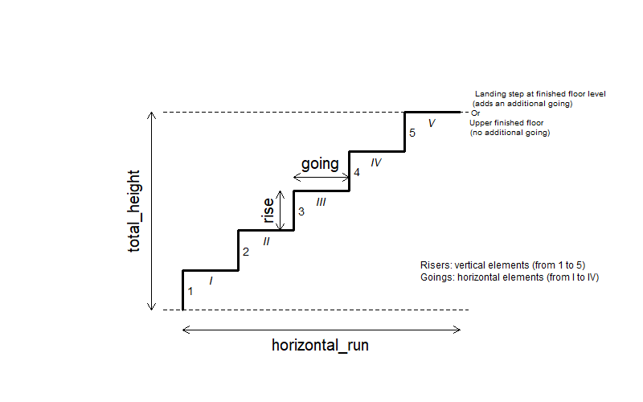

# Stair terminology

This page describes the terminology and naming conventions used
throughout stairtools to represent stair geometry.

## Details

The package uses the following conventions:

- `total_height`: total vertical distance between the lower and upper
  finished floors;

- `rise`: vertical height of one riser;

- `n_risers`: number of risers required to reach the upper floor;

- `going`: horizontal depth of one tread;

- `horizontal_run`: total horizontal footprint of the staircase.

- `landing`: Horizontal platform reached at the end of a staircase. The
  last going may lead either to a landing or directly to the upper
  finished floor.

A *riser* is the vertical element between two consecutive treads. A
*going* refers to the horizontal depth of a *tread* (horizontal surface
of a step).

A complete step is composed of one riser and one tread. The package uses
`n_risers` rather than "number of steps" because the number of vertical
increments is the quantity required to compute the total height of a
staircase.

Stair comfort is commonly evaluated using Blondel's formula:

\$\$2 \times rise + going\$\$

where `rise` and `going` are expressed in centimetres.
